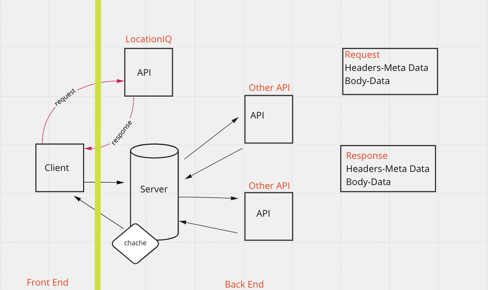
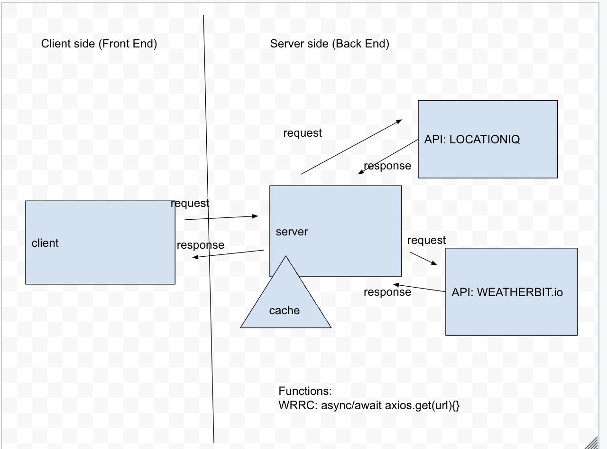
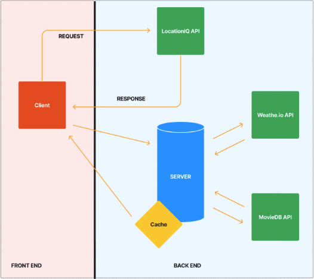
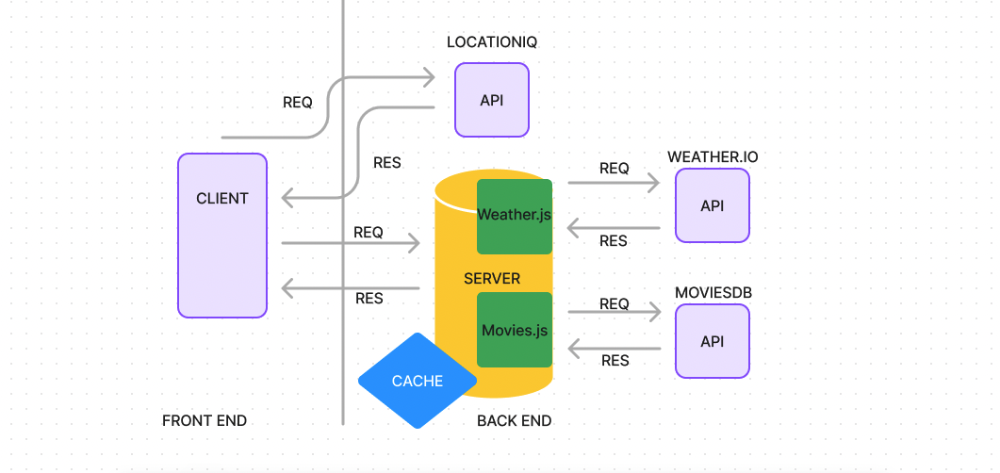
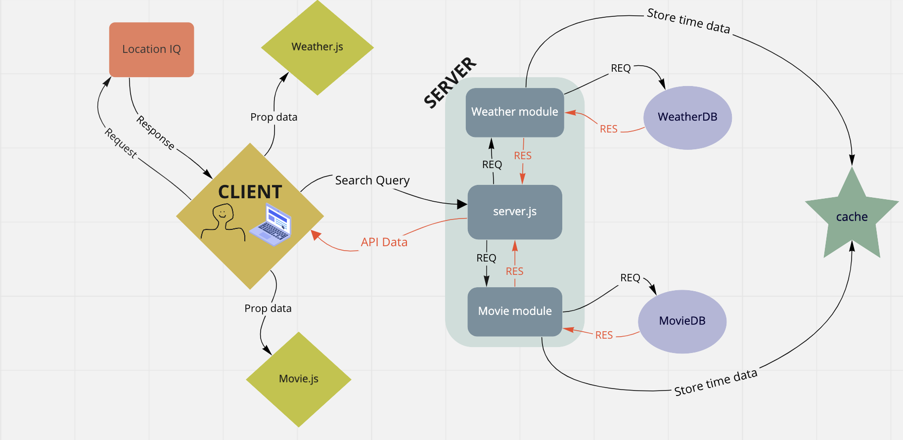

# city-explorer-api

# Project Name

**Author**: Stephen Martinez
**Version**: 1.0.0 (increment the patch/fix version number if you make more commits past your first submission)

* 

* 

* 

* 

* 

## Overview
<!-- Provide a high level overview of what this application is and why you are building it, beyond the fact that it's an assignment for this class. (i.e. What's your problem domain?) -->
* Were building a back end server to be our weather API.  We're building it from the ground up and will implement it into our front end code.

## Getting Started
<!-- What are the steps that a user must take in order to build this app on their own machine and get it running? -->
* create a repo, clone repo, create the api server and all of its componements, fill in the proper documentation, and link it to your front end.

## Architecture
<!-- Provide a detailed description of the application design. What technologies (languages, libraries, etc) you're using, and any other relevant design information. -->

## Change Log
<!-- Use this area to document the iterative changes made to your application as each feature is successfully implemented. Use time stamps. Here's an example:

01-01-2001 4:59pm - Application now has a fully-functional express server, with a GET route for the location resource. -->
06/21/2022 2110hrs - application is now functional.  

## Credit and Collaborations
<!-- Give credit (and a link) to other people or resources that helped you build this application. -->
* got help from TA/Audrey/Jamall M.

## Time Estimates

* Name of feature: city-explorer-api

* Estimate of time needed to complete: 5hrs

* Start time: 1430

* Finish time: 2130

* Actual time needed to complete: 7hrs

----

Name of feature: added weather and forecast

Estimate of time needed to complete: 5hrs

Start time: 1430

Finish time: 2130

Actual time needed to complete: 7hrs

----

Name of feature: backend, react repo, spi keys

Estimate of time needed to complete: 5hrs

Start time: 1430

Finish time: 2300

Actual time needed to complete: 9hrs

----

Name of feature: refactor add modules and readme

Estimate of time needed to complete: 5hrs

Start time: 1300

Finish time: 1600

Actual time needed to complete: 3hrs